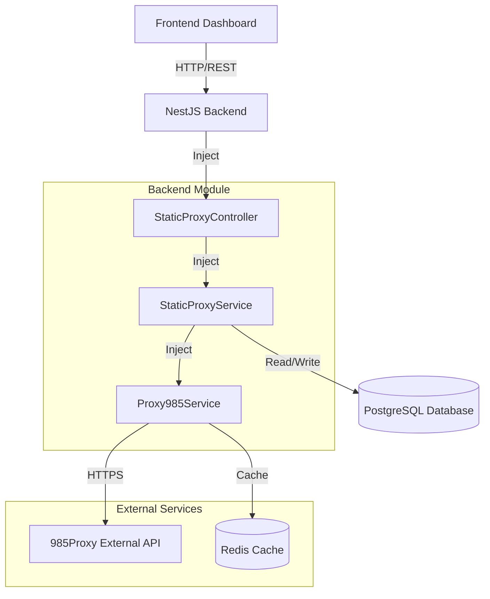

# Design Document: 985Proxy Full API Integration

## Overview

This design document outlines the complete integration of all 7 985Proxy APIs into the ProxyHub platform. The integration will transform ProxyHub from using mock data to providing real-time proxy inventory, pricing, purchasing, and management capabilities powered by the 985Proxy service.

**Scope**: Full integration of 985Proxy external API service including:
- Real-time inventory checking
- Dynamic price calculation
- Live IP list management
- IP detail queries
- IP renewal functionality
- Order status tracking
- Business channel (Zone) management

## Steering Document Alignment

### Technical Standards (tech.md)
- **NestJS Modules**: All new services follow NestJS dependency injection patterns
- **Service Layer Architecture**: Business logic separated from API controllers
- **Error Handling**: Consistent exception handling with custom error types
- **Logging**: Structured logging for all external API calls
- **Environment Configuration**: All API credentials managed via `.env` file

### Project Structure (structure.md)
- **Backend**: `backend/src/modules/proxy985/` - Dedicated module for 985Proxy integration
- **Frontend**: `frontend/src/api/static-proxy.ts` - API client methods
- **Frontend Components**: `frontend/src/views/` - UI components for displaying data

## Code Reuse Analysis

### Existing Components to Leverage

1. **Proxy985Service** (`backend/src/modules/proxy985/proxy985.service.ts`)
   - Already has `buyStaticProxy` method (recently fixed)
   - Will be extended with 6 additional API methods
   - Existing HTTP client setup will be reused

2. **StaticProxyService** (`backend/src/modules/proxy/static/static-proxy.service.ts`)
   - Currently handles purchase flow (recently updated to call real API)
   - Will be extended to handle inventory checking, renewal, and IP management
   - Existing database transaction logic will be leveraged

3. **StaticProxyController** (`backend/src/modules/proxy/static/static-proxy.controller.ts`)
   - Will add new endpoints for inventory, IP list, renewal, etc.
   - Existing authentication guards will be reused

4. **Frontend API Client** (`frontend/src/api/static-proxy.ts`)
   - Will add new methods for calling new backend endpoints
   - Existing axios interceptors handle authentication

5. **Dashboard Component** (`frontend/src/views/Dashboard.vue`)
   - Will integrate real-time statistics from 985Proxy
   - Will replace mock data with live API calls

### Integration Points

- **Database**: `static_proxies` table will store additional fields (order_no, expiration tracking)
- **Redis**: Will cache inventory data and pricing calculations (5-minute TTL)
- **Authentication**: All endpoints require JWT authentication
- **Transaction Management**: Critical operations (purchase, renewal) wrapped in DB transactions

## Architecture

### System Architecture Diagram



### Data Flow

1. **Inventory Check Flow**
   ```
   User opens purchase page → Frontend calls /api/v1/static-proxy/inventory
   → StaticProxyController → StaticProxyService → Proxy985Service.getStock()
   → Check Redis cache → If miss, call 985Proxy API → Cache result (5 min)
   → Return to frontend → Display available countries/cities
   ```

2. **Purchase Flow** (Enhanced)
   ```
   User submits purchase → Frontend calls calculate API first → Display total price
   → User confirms → Call purchase API → StaticProxyService.purchase()
   → Call 985Proxy buy API → Get order_no → Poll order_result API
   → When success, call ip_list API → Get actual IPs → Save to DB
   → Return success to user
   ```

3. **IP Management Flow**
   ```
   User views "My Proxies" → Call /api/v1/static-proxy/my-ips
   → StaticProxyService queries DB + calls ip_list API → Merge data
   → Display IP list with expiration dates → User can renew
   ```

### Modular Design Principles

- **Single File Responsibility**: 
  - `proxy985.service.ts` handles ONLY external API calls
  - `static-proxy.service.ts` handles ONLY business logic
  - Controllers handle ONLY HTTP request/response

- **Component Isolation**: 
  - Frontend components are split: `PurchaseForm.vue`, `IPList.vue`, `RenewalDialog.vue`

- **Service Layer Separation**: 
  - Data access: TypeORM repositories
  - Business logic: Service classes
  - Presentation: Controllers and Vue components

## Components and Interfaces

### Backend Component 1: Proxy985Service

**File**: `backend/src/modules/proxy985/proxy985.service.ts`

**Purpose**: Low-level HTTP client for all 985Proxy API endpoints

**New Interfaces** (7 methods):

```typescript
// 1. Get stock/inventory
async getStock(params: {
  zone: string;
  time_period: number;
  static_proxy_type: 'shared' | 'premium';
}): Promise<{
  code: number;
  data: Array<{
    country_code: string;
    country_name: string;
    stock: number;
    cities: Array<{
      city_name: string;
      stock: number;
    }>;
  }>;
}>

// 2. Calculate price
async calculatePrice(data: {
  zone: string;
  time_period: number;
  static_proxy_type: 'shared' | 'premium';
  buy_data: Array<{
    country_code: string;
    city_name?: string;
    count: number;
  }>;
}): Promise<{
  code: number;
  data: {
    amount: number;
    currency: string;
  };
}>

// 3. Get IP list
async getIPList(params: {
  zone: string;
  page?: number;
  per_page?: number;
  country_code?: string;
  ip?: string;
}): Promise<{
  code: number;
  data: {
    data: Array<{
      ip: string;
      port: number;
      username: string;
      password: string;
      country_code: string;
      city_name: string;
      expire_at: string;
      plan: string;
    }>;
    total: number;
    per_page: number;
    current_page: number;
  };
}>

// 4. Get IP detail
async getIPDetail(params: {
  zone: string;
  ip: string;
}): Promise<{
  code: number;
  data: {
    ip: string;
    port: number;
    username: string;
    password: string;
    country_code: string;
    city_name: string;
    expire_at: string;
    plan: string;
  };
}>

// 5. Renew IP
async renewIP(data: {
  zone: string;
  ip: string;
  time_period: number;
}): Promise<{
  code: number;
  data: {
    order_no: string;
  };
}>

// 6. Get order result
async getOrderResult(params: {
  zone: string;
  order_no: string;
}): Promise<{
  code: number;
  data: {
    order_no: string;
    status: 'pending' | 'completed' | 'failed';
    amount: number;
    currency: string;
  };
}>

// 7. Get business list (zones)
async getBusinessList(): Promise<{
  code: number;
  data: Array<{
    zone: string;
    name: string;
    status: string;
  }>;
}>
```

**Dependencies**: 
- `@nestjs/common` (Injectable, Logger, HttpException)
- `axios` (HTTP client)
- Environment variables: `PROXY_985_API_KEY`, `PROXY_985_ZONE`

**Reuses**: Existing `client` (axios instance), existing error handling pattern

---

### Backend Component 2: StaticProxyService (Enhanced)

**File**: `backend/src/modules/proxy/static/static-proxy.service.ts`

**Purpose**: Business logic layer that orchestrates 985Proxy API calls with database operations

**New Methods**:

```typescript
// Get available inventory with caching
async getInventory(ipType: string, duration: number): Promise<InventoryDto>

// Calculate total price before purchase
async calculatePurchasePrice(dto: PurchaseStaticProxyDto): Promise<PriceDto>

// List user's purchased IPs (paginated)
async listMyIPs(userId: string, page: number, limit: number): Promise<MyIPsDto>

// Get single IP details
async getIPDetails(userId: string, ip: string): Promise<IPDetailDto>

// Renew an IP
async renewIP(userId: string, ip: string, duration: number): Promise<RenewalResultDto>

// Check order status
async checkOrderStatus(userId: string, orderNo: string): Promise<OrderStatusDto>

// Sync IPs from 985Proxy (admin only, called by cron job)
async syncIPsFromRemote(): Promise<SyncResultDto>
```

**Dependencies**: 
- `Proxy985Service` (injected)
- `StaticProxyRepository` (database)
- `RedisService` (caching)
- `TransactionService` (database transactions)

**Reuses**: 
- Existing `purchaseStaticProxy` method
- Existing balance checking logic
- Existing transaction creation logic

---

### Backend Component 3: StaticProxyController (Enhanced)

**File**: `backend/src/modules/proxy/static/static-proxy.controller.ts`

**Purpose**: HTTP endpoints for frontend to call

**New Routes**:

```typescript
// GET /api/v1/static-proxy/inventory
@Get('inventory')
@UseGuards(JwtAuthGuard)
async getInventory(@Query() query: InventoryQueryDto)

// POST /api/v1/static-proxy/calculate-price
@Post('calculate-price')
@UseGuards(JwtAuthGuard)
async calculatePrice(@Body() dto: PurchaseStaticProxyDto)

// GET /api/v1/static-proxy/my-ips
@Get('my-ips')
@UseGuards(JwtAuthGuard)
async getMyIPs(@Request() req, @Query() query: PaginationDto)

// GET /api/v1/static-proxy/ip/:ip
@Get('ip/:ip')
@UseGuards(JwtAuthGuard)
async getIPDetail(@Request() req, @Param('ip') ip: string)

// POST /api/v1/static-proxy/renew
@Post('renew')
@UseGuards(JwtAuthGuard)
async renewIP(@Request() req, @Body() dto: RenewIPDto)

// GET /api/v1/static-proxy/order/:orderNo
@Get('order/:orderNo')
@UseGuards(JwtAuthGuard)
async getOrderStatus(@Request() req, @Param('orderNo') orderNo: string)
```

**Dependencies**: JwtAuthGuard, StaticProxyService

**Reuses**: Existing guards, existing response formatting

---

### Frontend Component 1: Enhanced Purchase Form

**File**: `frontend/src/views/proxy/StaticProxy.vue`

**Purpose**: Show real-time inventory and pricing

**Changes**:
- Add inventory API call on component mount
- Show available countries/cities dynamically
- Add "Calculate Price" button before purchase
- Display calculated price preview
- Disable "Purchase" if insufficient balance

**New API Calls**:
```typescript
import { getInventory, calculatePrice, purchaseProxy } from '@/api/static-proxy'

// On mount
const inventory = await getInventory({ ipType, duration })

// On form change
const price = await calculatePrice(formData)

// On submit
const result = await purchaseProxy(formData)
```

---

### Frontend Component 2: My IPs List

**File**: `frontend/src/views/proxy/MyProxies.vue` (new file)

**Purpose**: Display user's purchased IPs with management options

**Features**:
- Paginated IP list
- Filter by country
- Search by IP
- Show expiration countdown
- "Renew" button for each IP
- "View Details" link

**API Calls**:
```typescript
import { getMyIPs, getIPDetail, renewIP } from '@/api/static-proxy'
```

---

### Frontend Component 3: Dashboard Statistics

**File**: `frontend/src/views/Dashboard.vue`

**Purpose**: Show real-time statistics from 985Proxy

**Enhancements**:
- Replace mock total_ips with count from `getMyIPs` API
- Add "Active IPs" widget (count of non-expired IPs)
- Add "Expiring Soon" widget (IPs expiring in < 7 days)
- Add "Available Balance" from user account

---

## Data Models

### Database Schema Extension

**Table**: `static_proxies` (existing, add new fields)

```sql
ALTER TABLE static_proxies 
ADD COLUMN order_no VARCHAR(255),
ADD COLUMN expire_at TIMESTAMP,
ADD COLUMN plan VARCHAR(50),
ADD COLUMN last_synced_at TIMESTAMP,
ADD INDEX idx_expire_at (expire_at),
ADD INDEX idx_order_no (order_no);
```

### New DTOs (Data Transfer Objects)

**InventoryDto**
```typescript
interface InventoryDto {
  countries: Array<{
    countryCode: string;
    countryName: string;
    stock: number;
    cities: Array<{
      cityName: string;
      stock: number;
    }>;
  }>;
}
```

**PriceDto**
```typescript
interface PriceDto {
  amount: number;
  currency: string;
  breakdown: Array<{
    country: string;
    city?: string;
    quantity: number;
    unitPrice: number;
    subtotal: number;
  }>;
}
```

**MyIPsDto**
```typescript
interface MyIPsDto {
  data: Array<{
    ip: string;
    port: number;
    username: string;
    password: string;
    country: string;
    city: string;
    expiresAt: string;
    daysRemaining: number;
    status: 'active' | 'expiring_soon' | 'expired';
  }>;
  total: number;
  page: number;
  perPage: number;
}
```

**RenewalResultDto**
```typescript
interface RenewalResultDto {
  success: boolean;
  orderNo: string;
  newExpirationDate: string;
  amountCharged: number;
}
```

---

## Error Handling

### Error Scenarios

1. **Scenario: 985Proxy API Rate Limit**
   - **Handling**: Catch 429 status, implement exponential backoff, cache results longer
   - **User Impact**: Show "Service busy, please try again in a moment"

2. **Scenario: Insufficient Balance**
   - **Handling**: Check balance before calling 985Proxy API
   - **User Impact**: Show "Insufficient balance" with recharge button

3. **Scenario: Out of Stock**
   - **Handling**: Inventory API returns 0 stock
   - **User Impact**: Disable country/city selection, show "Out of stock"

4. **Scenario: Order Pending**
   - **Handling**: Poll order_result API every 3 seconds (max 10 attempts)
   - **User Impact**: Show loading spinner "Processing your order..."

5. **Scenario: IP Already Expired**
   - **Handling**: Check expiration before renewal
   - **User Impact**: Show "This IP has expired and cannot be renewed"

6. **Scenario: Network Timeout**
   - **Handling**: Set 30s timeout, retry once
   - **User Impact**: Show "Request timeout, please try again"

---

## Testing Strategy

### Unit Testing

**Backend Services**:
- Mock 985Proxy API responses
- Test each Proxy985Service method with mock axios
- Test StaticProxyService business logic with mock Proxy985Service
- Test price calculations
- Test inventory caching logic

**Frontend Components**:
- Mock API calls
- Test component rendering with various data states
- Test error handling UI

### Integration Testing

**API Flow Testing**:
- Test full purchase flow: inventory → calculate → buy → order status → IP list
- Test renewal flow: get IP → renew → check order → verify new expiration
- Test with `PROXY_985_TEST_MODE=true` to avoid real charges

**Database Testing**:
- Test transaction rollback on API failure
- Test IP sync logic

### End-to-End Testing

**User Scenarios**:
1. User opens purchase page → sees real inventory → calculates price → purchases → sees new IP in "My IPs"
2. User opens "My IPs" → sees expiring IP → clicks renew → completes renewal → expiration date updated
3. Admin opens dashboard → sees real statistics → clicks "Sync IPs" → IPs synchronized

**Testing with Chrome DevTools MCP**:
- Navigate to purchase page
- Fill form with real data
- Verify inventory displayed correctly
- Calculate price and verify amount
- Complete purchase and verify deduction from 985Proxy balance
- Check "My IPs" and verify IP appears

---

## Performance Considerations

### Caching Strategy

- **Inventory Data**: 5-minute Redis cache (key: `inventory:${zone}:${ipType}:${duration}`)
- **IP List**: 30-second cache per user (key: `user_ips:${userId}`)
- **Price Calculation**: 1-minute cache (key: `price:${hash(params)}`)

### Rate Limiting

- Max 10 requests/minute per user for inventory checks
- Max 5 purchase attempts/minute per user
- Admin sync: Max once per 10 minutes

### Database Optimization

- Add indexes on `expire_at`, `order_no`, `user_id`
- Use pagination for IP lists (default 20 per page)
- Batch IP sync updates (100 IPs per transaction)

---

## Security Considerations

- **API Key Protection**: Store in `.env`, never expose to frontend
- **Zone ID Validation**: Verify user owns the zone before API calls
- **Input Sanitization**: Validate all user inputs (country codes, IP addresses)
- **Rate Limiting**: Prevent abuse of expensive API calls
- **Transaction Integrity**: Use DB transactions for financial operations

---

## Deployment Checklist

1. ✅ Update `.env` with correct `PROXY_985_ZONE` and `PROXY_985_API_KEY`
2. ✅ Run database migration to add new fields
3. ✅ Set `PROXY_985_TEST_MODE=false` for production
4. ✅ Deploy backend with new endpoints
5. ✅ Deploy frontend with new components
6. ✅ Test purchase flow with small amount ($1-2)
7. ✅ Monitor logs for API errors
8. ✅ Set up cron job for IP sync (runs every 6 hours)

---

## Success Metrics

- ✅ All 7 985Proxy APIs integrated and functional
- ✅ Real-time inventory displayed on purchase page
- ✅ Successful test purchase with actual deduction from 985Proxy balance
- ✅ "My IPs" page shows live data from 985Proxy
- ✅ IP renewal works correctly
- ✅ Dashboard statistics reflect real data
- ✅ No mock data remaining in critical flows

