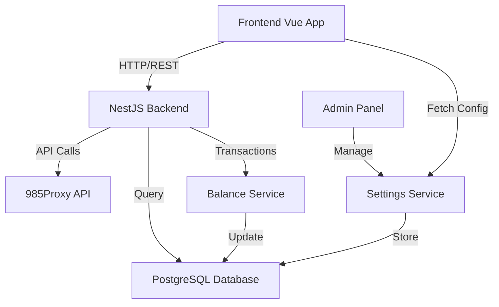

# Design Document

## Overview

This design addresses platform-wide improvements to enhance admin operations, simplify balance management, and improve data consistency. The implementation spans backend services, frontend components, database schema updates, and API integrations with 985Proxy.

**Key Technical Goals:**
- Remove gift_balance complexity from all layers
- Implement dynamic configuration system for customer service links
- Enhance admin UI with better data visualization tools
- Integrate 985Proxy dynamic residential API
- Replace all hardcoded/mock data with real database queries

## Steering Document Alignment

### Technical Standards

**Backend (NestJS):**
- Service layer for business logic
- Controller layer for API endpoints
- Repository pattern for database access
- DTOs with class-validator for input validation
- Transaction management for atomic operations

**Frontend (Vue 3 + Element Plus):**
- Composables for shared logic
- API service modules for backend communication
- Reactive refs for state management
- Toast notifications for user feedback

### Project Structure

```
backend/src/modules/
  - admin/           # Admin operations (balance, users, settlements)
  - user/            # User entity and basic operations
  - proxy/
    - static/        # Static residential proxy management
    - dynamic/       # Dynamic residential proxy management
  - proxy985/        # 985Proxy API integration layer
  - settings/        # System settings (customer service links, etc.)
  
frontend/src/
  - api/modules/     # API service layer
  - views/
    - admin/         # Admin panel views
    - proxy/         # Proxy management views
    - account/       # User account center
  - components/      # Reusable components
```

## Code Reuse Analysis

### Existing Components to Leverage

- **backend/src/modules/proxy985/proxy985.service.ts**: Add new methods for dynamic proxy API (`getCityList`, `extractProxy`)
- **backend/src/modules/admin/admin.service.ts**: Extend for user IP query and balance operations
- **frontend/src/api/modules/admin.ts**: Add new API calls for user IP query
- **frontend/src/components/**: Reuse Element Plus table, dialog, and form components
- **backend/src/common/decorators/**: Use existing `@Public()`, `@Roles()` decorators

### Integration Points

- **Database (PostgreSQL)**: 
  - Modify `users` table (remove gift_balance usage)
  - Add `dynamic_proxy_extractions` table
  - Add `settlements` table
  - Query existing `static_proxies`, `dynamic_channels`, `orders`, `transactions` tables

- **985Proxy API**:
  - `GET /res_rotating/city_list` - Country list for dynamic proxy
  - `GET /res_rotating/extract` - Extract dynamic proxy IPs

## Architecture

### System Architecture



### Modular Design Principles

1. **Backend Modularity**:
   - `admin.service.ts`: Admin-specific operations (user management, settlements, IP queries)
   - `settings.service.ts`: System configuration management
   - `proxy985.service.ts`: Centralized 985Proxy API client
   - `dynamic-proxy.service.ts`: Dynamic proxy business logic
   - `static-proxy.service.ts`: Enhanced with export functionality

2. **Frontend Modularity**:
   - `UserIPModal.vue`: Reusable modal for displaying user IPs
   - `ExportButton.vue`: Generic export functionality (Excel/TXT)
   - `DynamicProxyExtractDialog.vue`: IP extraction interface
   - API services separated by domain (admin, proxy, settings)

## Components and Interfaces

### Backend Components

#### 1. Settings Service
**File:** `backend/src/modules/settings/settings.service.ts`

```typescript
class SettingsService {
  async getSettings(): Promise<SystemSettings>
  async updateSettings(dto: UpdateSettingsDto): Promise<SystemSettings>
  async getTelegramLinks(): Promise<{ telegram1: string, telegram2: string }>
}
```

**Purpose:** Manage system-wide configuration
**Database Table:** `settings` (key-value pairs)

#### 2. Admin Service Extensions
**File:** `backend/src/modules/admin/admin.service.ts`

```typescript
// New methods to add:
async getUserIPs(userId: string): Promise<{
  staticProxies: StaticProxy[]
  dynamicChannels: DynamicChannel[]
  recentTransactions: Transaction[]
}>

async createUser(dto: CreateUserDto): Promise<User>

async getSettlements(query: SettlementQueryDto): Promise<Settlement[]>

async createSettlement(dto: CreateSettlementDto): Promise<Settlement>
```

#### 3. Dynamic Proxy Service
**File:** `backend/src/modules/proxy/dynamic/dynamic-proxy.service.ts` (New)

```typescript
class DynamicProxyService {
  async extractProxy(userId: string, channelId: string, dto: ExtractProxyDto): Promise<{
    ipList: string[]
    trafficConsumed: number
    cost: number
  }>
  
  async getExtractionHistory(userId: string, channelId: string): Promise<DynamicProxyExtraction[]>
}
```

#### 4. Proxy985 Service Extensions
**File:** `backend/src/modules/proxy985/proxy985.service.ts`

```typescript
// New methods to add:
async getCityList(): Promise<Proxy985Response<CityList>>

async extractProxy(params: {
  zone: string
  num: number
  area?: string
  life?: number
  format?: number
}): Promise<Proxy985Response<any>>
```

#### 5. Static Proxy Service Extensions
**File:** `backend/src/modules/proxy/static/static-proxy.service.ts`

```typescript
// New method:
async exportIPsAsTXT(userId: string): Promise<string>
```

### Frontend Components

#### 1. User IP Modal
**File:** `frontend/src/components/UserIPModal.vue`

**Props:**
```typescript
interface Props {
  userId: string
  userName: string
  visible: boolean
}
```

**Features:**
- Tab view for Static IPs / Dynamic Channels / Transactions
- Export to Excel button
- Real-time data loading

#### 2. Add User Dialog
**File:** `frontend/src/views/admin/Users.vue` (enhance existing)

**Form Fields:**
- Email (required, email validation)
- Password (required, min 8 chars)
- Role (select: user/admin)
- Initial Balance (number, default 0)

#### 3. Dynamic Proxy Extract Dialog
**File:** `frontend/src/views/proxy/DynamicExtractDialog.vue` (New)

**Props:**
```typescript
interface Props {
  channel: DynamicChannel
  visible: boolean
}
```

**Form Fields:**
- Country selection (from 985Proxy API)
- Quantity (number input)
- Proxy lifetime (select: 30/60/120 minutes)
- Data format (select: TXT/JSON)

#### 4. Static IP Table Enhancement
**File:** `frontend/src/views/proxy/StaticManage.vue`

**Changes:**
- Horizontal scrollable table
- All columns in one row
- Working copy button with clipboard API
- Export TXT button

## Data Models

### Database Schema Changes

#### 1. Remove gift_balance Usage

**Migration:**
```sql
-- Step 1: Merge existing gift_balance into balance
UPDATE users 
SET balance = balance + COALESCE(gift_balance, 0)
WHERE gift_balance > 0;

-- Step 2: Drop gift_balance column (optional, for clean removal)
-- ALTER TABLE users DROP COLUMN gift_balance;

-- Note: Can keep column for backward compatibility but stop using it
```

#### 2. New Table: dynamic_proxy_extractions

```sql
CREATE TABLE dynamic_proxy_extractions (
  id SERIAL PRIMARY KEY,
  user_id INTEGER NOT NULL REFERENCES users(id) ON DELETE CASCADE,
  channel_id INTEGER NOT NULL REFERENCES dynamic_channels(id) ON DELETE CASCADE,
  extracted_count INTEGER NOT NULL,
  country_code VARCHAR(10),
  ip_list JSONB NOT NULL,
  traffic_consumed DECIMAL(10,2) DEFAULT 0,
  cost DECIMAL(10,2) DEFAULT 0,
  created_at TIMESTAMP DEFAULT NOW()
);

CREATE INDEX idx_extractions_user ON dynamic_proxy_extractions(user_id);
CREATE INDEX idx_extractions_channel ON dynamic_proxy_extractions(channel_id);
```

#### 3. New Table: settlements

```sql
CREATE TABLE settlements (
  id SERIAL PRIMARY KEY,
  settlement_no VARCHAR(50) UNIQUE NOT NULL,
  start_date TIMESTAMP NOT NULL,
  end_date TIMESTAMP NOT NULL,
  total_amount DECIMAL(10,2) NOT NULL,
  order_count INTEGER DEFAULT 0,
  status VARCHAR(20) DEFAULT 'pending',
  created_at TIMESTAMP DEFAULT NOW(),
  completed_at TIMESTAMP
);

CREATE INDEX idx_settlements_status ON settlements(status);
CREATE INDEX idx_settlements_dates ON settlements(start_date, end_date);
```

#### 4. New Table: settings

```sql
CREATE TABLE settings (
  key VARCHAR(100) PRIMARY KEY,
  value TEXT NOT NULL,
  updated_at TIMESTAMP DEFAULT NOW()
);

-- Insert default values
INSERT INTO settings (key, value) VALUES
  ('telegram_support_1', 'lubei12'),
  ('telegram_support_2', 'lubei12');
```

#### 5. Enhance dynamic_channels Table

```sql
ALTER TABLE dynamic_channels 
ADD COLUMN IF NOT EXISTS zone_id VARCHAR(100),
ADD COLUMN IF NOT EXISTS package_type VARCHAR(20) DEFAULT 'personal',
ADD COLUMN IF NOT EXISTS traffic_limit DECIMAL(10,2),
ADD COLUMN IF NOT EXISTS traffic_used DECIMAL(10,2) DEFAULT 0,
ADD COLUMN IF NOT EXISTS price_per_gb DECIMAL(10,2) DEFAULT 4.5,
ADD COLUMN IF NOT EXISTS monthly_fee DECIMAL(10,2);
```

### DTOs (Data Transfer Objects)

#### Backend DTOs

```typescript
// backend/src/modules/admin/dto/create-user.dto.ts
export class CreateUserDto {
  @IsEmail()
  email: string;

  @IsString()
  @MinLength(8)
  password: string;

  @IsEnum(['user', 'admin'])
  role: string;

  @IsNumber()
  @Min(0)
  initialBalance: number;
}

// backend/src/modules/proxy/dynamic/dto/extract-proxy.dto.ts
export class ExtractProxyDto {
  @IsString()
  @IsOptional()
  country?: string;

  @IsNumber()
  @Min(1)
  @Max(100)
  quantity: number;

  @IsNumber()
  @IsOptional()
  @IsIn([30, 60, 120])
  lifetime?: number;

  @IsNumber()
  @IsOptional()
  @IsIn([1, 2])
  format?: number;
}

// backend/src/modules/settings/dto/update-settings.dto.ts
export class UpdateSettingsDto {
  @IsString()
  @IsOptional()
  telegram_support_1?: string;

  @IsString()
  @IsOptional()
  telegram_support_2?: string;
}
```

## API Endpoints

### New/Modified Endpoints

#### Settings Management
```
GET    /api/v1/settings              - Get all settings
GET    /api/v1/settings/telegram     - Get Telegram links only
PUT    /api/v1/settings              - Update settings (Admin only)
```

#### Admin Operations
```
GET    /api/v1/admin/users/:id/ips   - Get user's purchased IPs
POST   /api/v1/admin/users            - Create new user
GET    /api/v1/admin/users/:id/ips/export-excel  - Export user IPs as Excel
GET    /api/v1/admin/settlements      - Get settlement list
POST   /api/v1/admin/settlements      - Create new settlement
GET    /api/v1/admin/settlements/:id  - Get settlement details
```

#### Dynamic Proxy
```
GET    /api/v1/proxy/dynamic/countries        - Get available countries
POST   /api/v1/proxy/dynamic/:channelId/extract  - Extract IPs
GET    /api/v1/proxy/dynamic/:channelId/history - Get extraction history
```

#### Static Proxy Enhancement
```
GET    /api/v1/proxy/static/export-txt  - Export user's IPs as TXT
```

## Balance Management Refactor

### Strategy: Gradual Migration

**Phase 1: Code Changes (No Data Loss)**
1. Update all service methods to only use `balance` field
2. Frontend stops displaying `gift_balance`
3. Admin operations (add/deduct) only affect `balance`
4. Keep `gift_balance` column in database (for rollback safety)

**Phase 2: Data Migration (After Testing)**
1. Run SQL migration to merge gift_balance into balance
2. Optionally drop gift_balance column

### Affected Files

**Backend:**
- `backend/src/modules/user/entities/user.entity.ts` - Remove gift_balance from DTOs
- `backend/src/modules/admin/admin.service.ts` - Remove giftBalance() method
- `backend/src/modules/proxy/static/static-proxy.service.ts` - Remove gift_balance deduction logic
- `backend/src/modules/billing/entities/transaction.entity.ts` - Remove GIFT transaction type

**Frontend:**
- `frontend/src/views/account/Center.vue` - Remove gift balance display
- `frontend/src/views/admin/Users.vue` - Remove gift balance column and operations
- `frontend/src/views/admin/Dashboard.vue` - Update balance display logic

## Error Handling

### Error Scenarios

1. **985Proxy API Failure (Extract IPs)**
   - **Handling:** Catch error, rollback transaction, don't deduct balance
   - **User Impact:** Show error toast: "IP提取失败，请稍后重试。您的余额未被扣除。"
   - **Logging:** Log error details for debugging

2. **Insufficient Balance (Dynamic Proxy)**
   - **Handling:** Check balance before calling API
   - **User Impact:** Show error: "余额不足，请先充值。当前余额: $X.XX，需要: $Y.YY"

3. **User Not Found (View IPs)**
   - **Handling:** Return 404 with clear message
   - **User Impact:** Show toast: "用户不存在或已被删除"

4. **Copy to Clipboard Failure**
   - **Handling:** Catch clipboard API error, show fallback message
   - **User Impact:** Show error: "复制失败，请手动复制"

5. **Export File Generation Failure**
   - **Handling:** Try-catch around file generation, return 500 if fails
   - **User Impact:** Show error: "导出失败，请重试或联系客服"

6. **Settings Update Failure**
   - **Handling:** Validate input, use transaction for updates
   - **User Impact:** Show validation errors or generic error message

## Testing Strategy

### Unit Testing

**Backend Services:**
- `admin.service.spec.ts`: Test getUserIPs, createUser, settlement methods
- `dynamic-proxy.service.spec.ts`: Test extractProxy with mocked 985Proxy responses
- `settings.service.spec.ts`: Test CRUD operations
- Mock external dependencies (985Proxy API, database)

**Frontend Components:**
- `UserIPModal.spec.ts`: Test data display, export functionality
- `DynamicExtractDialog.spec.ts`: Test form validation, submission

### Integration Testing

**API Endpoints:**
- Test complete flows: Create user → View IPs → Export
- Test dynamic proxy: Create channel → Extract IPs → Check balance deduction
- Test settings: Update Telegram links → Fetch from frontend

**Database Operations:**
- Test transaction rollback on 985Proxy API failure
- Test balance migration from gift_balance to balance
- Test settlement creation with order aggregation

### End-to-End Testing (Manual)

**User Scenarios:**
1. Admin creates new user with initial balance
2. Admin views user's purchased IPs and exports to Excel/TXT
3. User extracts dynamic proxy IPs, verifies balance deduction
4. Admin updates Telegram links, user sees new links immediately
5. Admin creates settlement for date range, views details
6. User copies IP credentials from static IP list
7. User exports static IPs as TXT with correct format

### Chrome DevTools Verification

Per user's development habits, verify:
1. Network tab: Check API responses are correct
2. Console: No JavaScript errors
3. Application tab: Verify clipboard write permission
4. Responsive design: Test horizontal scrolling on narrow screens
5. Performance: Check load times for large IP lists (100+ items)

## Implementation Priority

### Phase 1: Critical Fixes (P0)
1. Remove gift_balance system
2. Fix customer service links (dynamic configuration)
3. Fix "Add User" button

### Phase 2: Admin Tools (P1)
4. Implement "View User IPs" modal with export
5. Real settlement records

### Phase 3: Proxy Enhancements (P2)
6. Static IP UI enhancement (horizontal scroll, copy button fix, TXT export)
7. Dynamic residential management refactor

## Security Considerations

1. **Authorization**: All admin endpoints require `@Roles('admin')` decorator
2. **Input Validation**: Use DTOs with class-validator for all inputs
3. **API Key Protection**: 985Proxy API key stored in environment variables only
4. **SQL Injection**: Use TypeORM parameterized queries
5. **XSS Prevention**: Vue.js auto-escapes templates, Element Plus components are safe
6. **CORS**: Backend already configured, no changes needed

## Performance Optimizations

1. **Pagination**: User IP modal supports pagination for large datasets
2. **Lazy Loading**: Load tabs (Static/Dynamic/Transactions) on demand
3. **Caching**: Cache 985Proxy country list for 1 hour
4. **Database Indexing**: Add indexes on foreign keys and frequently queried fields
5. **Export Streaming**: Use streaming for large Excel/TXT exports (>1000 rows)


