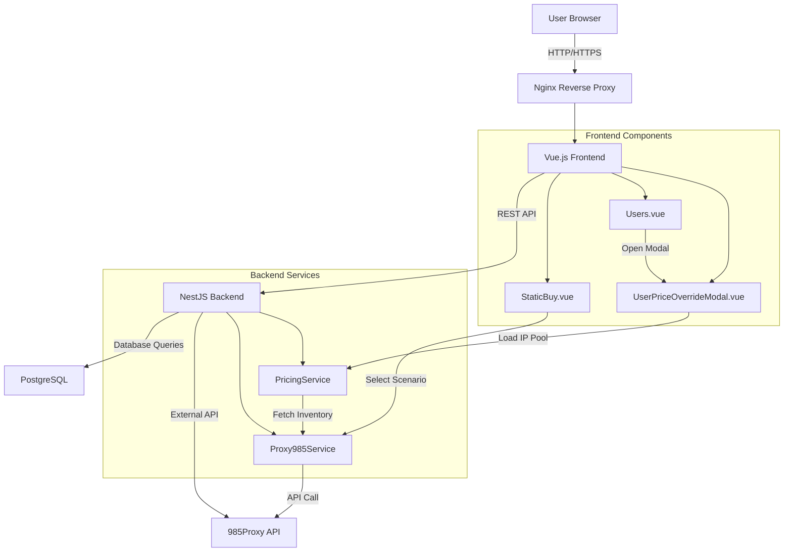

# Design Document

## Overview

This design document details the implementation of three critical enhancements to the ProxyHub platform:

1. **Business Scenario Selector** - Integrate 985Proxy's business scenarios into the static proxy purchase flow, enabling users to filter IP inventory by purpose (e.g., TikTok, Instagram, E-commerce)
2. **User-Level Price Override Management** - Enable administrators to set custom pricing for individual users through a modal interface that reuses the existing price override card-based UI pattern
3. **Mobile Responsive Improvements** - Apply comprehensive responsive CSS to all key pages for optimal mobile experience

These features leverage existing components and API infrastructure to minimize development time while maintaining consistency with the platform's design patterns.

## Steering Document Alignment

### Technical Standards

- **Frontend Framework**: Vue 3 Composition API with TypeScript
- **UI Library**: Element Plus components with custom SCSS theming
- **Backend Framework**: NestJS with TypeORM and PostgreSQL
- **API Integration**: Reuse existing `Proxy985Service` for 985Proxy API calls
- **State Management**: Vue Composition API with `ref` and `reactive` for local state
- **Authentication**: JWT-based with role guards (`@Roles('admin')`) for admin endpoints

### Project Structure

```
frontend/src/
  ├── views/
  │   ├── proxy/StaticBuy.vue         # Add business scenario selector
  │   ├── admin/Users.vue             # Add price override button & modal
  │   └── [other pages]               # Apply responsive styles
  ├── api/modules/
  │   ├── proxy985.ts                 # Add getBusinessList() API call
  │   └── admin.ts                    # Add getUserIpPool(), updateUserPriceOverrides()
  ├── components/
  │   └── UserPriceOverrideModal.vue  # New: Modal for user-specific price overrides
  └── styles/
      └── responsive.scss             # Enhance with mobile mixins

backend/src/modules/
  ├── proxy985/
  │   ├── proxy985.service.ts         # Already has getBusinessList() and getInventory()
  │   └── proxy985.controller.ts      # Add getBusinessList endpoint
  └── pricing/
      ├── pricing.service.ts          # Extend for user-specific overrides
      ├── pricing.controller.ts       # Already has getUserIpPool() and batch update
      └── entities/
          └── price-override.entity.ts # Add userId column
```

## Code Reuse Analysis

### Existing Components to Leverage

- **`PriceOverrides.vue`**: Complete UI pattern for displaying IP pool as cards with price override inputs. Will be adapted as a reusable modal component for user-specific pricing.
- **`Proxy985Service`**: Already implements `getBusinessList()` and `getInventory(params)` with `purpose_web` support.
- **`PricingService`**: Has `getUserIpPoolForPriceOverride()` and `batchUpdateUserPriceOverrides()` methods (lines 164-183 in controller).
- **Responsive Mixins**: Existing SCSS variables and mixins in `styles/responsive.scss` for mobile breakpoints.

### Integration Points

- **985Proxy API**: Use `GET /res_static/business_list` for scenarios and `GET /res_static/inventory?purpose_web={scenario}` for filtered inventory
- **Backend API**: 
  - `GET /api/v1/proxy985/business-list` - New endpoint to expose business scenarios
  - `GET /api/v1/price/user-ip-pool/:userId` - Existing endpoint for user IP pool
  - `POST /api/v1/price/user-overrides/:userId/batch` - Existing endpoint for batch updates
- **Database**: Extend `price_override` table with `user_id` column (nullable) to support both global and user-specific overrides

## Architecture

### Overall Architecture Pattern



### Modular Design Principles

1. **Single File Responsibility**
   - `StaticBuy.vue` handles proxy purchase UI and business scenario filtering
   - `UserPriceOverrideModal.vue` handles user-specific price overrides (isolated component)
   - `Proxy985Service` handles all 985Proxy API communications
   - `PricingService` handles all pricing logic and database operations

2. **Component Isolation**
   - Create `UserPriceOverrideModal.vue` as a reusable modal component, not embedded in `Users.vue`
   - Business scenario selector as a standalone `<el-select>` component within `StaticBuy.vue`
   - Responsive styles applied through SCSS mixins, not inline styles

3. **Service Layer Separation**
   - Frontend API layer (`api/modules/`) abstracts HTTP calls from components
   - Backend service layer (`*.service.ts`) contains business logic
   - Backend controller layer (`*.controller.ts`) handles HTTP routing and validation

## Components and Interfaces

### Component 1: Business Scenario Selector (StaticBuy.vue Enhancement)

**Purpose:** Allow users to filter static proxy inventory by business scenario (purpose_web)

**Location:** `frontend/src/views/proxy/StaticBuy.vue`

**Interfaces:**
```typescript
interface BusinessScenario {
  code: string;        // e.g., "tiktok", "instagram"
  name: string;        // e.g., "TikTok", "Instagram"
  description?: string;
}

// API Call
function getBusinessList(): Promise<{ data: BusinessScenario[] }>

// Component State
const selectedScenario = ref<string>(''); // Empty = all scenarios
const businessScenarios = ref<BusinessScenario[]>([]);
```

**Dependencies:**
- `Proxy985Service.getBusinessList()` (backend)
- `Proxy985Service.getInventory({ static_proxy_type, purpose_web })` (backend)
- Element Plus `<el-select>` component

**Reuses:**
- Existing `loadInventory()` function in `StaticBuy.vue`
- Existing `proxy985.getInventory()` API call pattern

**Implementation Details:**
1. Add `<el-select>` for business scenarios above the IP selection grid
2. Fetch scenarios on component mount: `GET /api/v1/proxy985/business-list`
3. When scenario changes, reload inventory with `purpose_web` parameter
4. Display "全部场景" (All Scenarios) option to reset filter

---

### Component 2: User Price Override Modal (UserPriceOverrideModal.vue)

**Purpose:** Display and edit user-specific price overrides in a modal dialog

**Location:** `frontend/src/components/UserPriceOverrideModal.vue` (new file)

**Interfaces:**
```typescript
interface Props {
  userId: number;
  userName: string;
  visible: boolean;
}

interface Emits {
  (e: 'update:visible', value: boolean): void;
  (e: 'saved'): void; // Notify parent that changes were saved
}

interface IpPoolItem {
  country: string;
  countryName: string;
  city: string;
  ipType: 'shared' | 'premium';
  ipTypeName: string;
  defaultPrice: number;
  overridePrice: number | null; // User-specific override
  stock: number;
}

// API Calls
function getUserIpPool(userId: number): Promise<{ data: IpPoolItem[] }>
function batchUpdateUserPriceOverrides(userId: number, updates: any[]): Promise<void>
```

**Dependencies:**
- Element Plus `<el-dialog>`, `<el-input-number>`, `<el-button>`, `<el-tag>`
- Vue 3 Composition API (`ref`, `reactive`, `watch`, `computed`)
- `admin.getUserIpPool()` and `admin.updateUserPriceOverrides()` API functions

**Reuses:**
- CSS classes and layout structure from `PriceOverrides.vue`
- Card-based IP pool display pattern (flag image, country/city name, price inputs)
- Filter logic (IP type, continent, status, search)

**Implementation Details:**
1. Create modal component with `<el-dialog>` wrapper
2. Fetch user IP pool on modal open: `GET /api/v1/price/user-ip-pool/:userId`
3. Display IP cards in a grid layout (same CSS as `PriceOverrides.vue`)
4. Track local changes in a `Map<string, number | null>` (keyed by `${country}-${city}-${ipType}`)
5. On save, call `POST /api/v1/price/user-overrides/:userId/batch` with all changes
6. Emit `@saved` event to parent to refresh data if needed

---

### Component 3: Users.vue Enhancement (Price Override Button)

**Purpose:** Add "价格覆盖" button to each user row that opens the price override modal

**Location:** `frontend/src/views/admin/Users.vue`

**Interfaces:**
```typescript
// Add to table columns
{
  label: '操作',
  fixed: 'right',
  width: 200,
  actions: [
    { label: '价格覆盖', icon: 'Money', handler: (row) => openPriceOverrideModal(row) }
    // ... existing actions (edit, block, etc.)
  ]
}

// Component State
const priceOverrideModalVisible = ref(false);
const selectedUserId = ref<number>(0);
const selectedUserName = ref<string>('');
```

**Dependencies:**
- `UserPriceOverrideModal.vue` component
- Element Plus `<el-button>` with icon

**Implementation Details:**
1. Add "价格覆盖" button to actions column in users table
2. On click, open `<UserPriceOverrideModal>` with selected user's ID and name
3. Modal handles all loading, editing, and saving logic independently

---

### Component 4: Mobile Responsive Enhancements (Multiple Pages)

**Purpose:** Apply responsive CSS to ensure all pages work on mobile devices (viewport < 768px)

**Target Pages:**
- `Dashboard.vue` - Dashboard cards and charts
- `StaticBuy.vue` - Proxy purchase form
- `StaticManage.vue` - Proxy management table
- `Users.vue` (Admin) - User table
- `RechargeApproval.vue` (Admin) - Recharge orders table
- `PriceOverrides.vue` (Admin) - Price override cards
- `Orders.vue` (Admin) - Order table

**Responsive Patterns:**
```scss
// Apply these patterns to all target pages

// Mobile breakpoint mixin
@mixin mobile {
  @media (max-width: 768px) {
    @content;
  }
}

// Responsive patterns
.page-container {
  padding: 12px; // Reduce padding on mobile
  
  @include mobile {
    padding: 8px;
  }
}

.filter-card, .statistics-card {
  .filter-content, .statistics-content {
    flex-direction: column; // Stack filters vertically
    gap: 12px;
    
    @include mobile {
      flex-direction: column;
    }
  }
}

.el-table {
  @include mobile {
    // Hide non-essential columns
    .hidden-mobile {
      display: none;
    }
    
    // Make table scrollable
    overflow-x: auto;
  }
}

.cards-grid {
  grid-template-columns: repeat(auto-fill, minmax(280px, 1fr));
  
  @include mobile {
    grid-template-columns: 1fr; // Single column on mobile
  }
}

.header-actions {
  display: flex;
  gap: 8px;
  
  @include mobile {
    flex-direction: column;
    width: 100%;
    
    .el-button {
      width: 100%;
    }
  }
}
```

**Implementation Strategy:**
1. Add `@include mobile { ... }` blocks to each page's `<style>` section
2. Apply responsive classes to tables (`.hidden-mobile` for non-critical columns)
3. Transform card grids from multi-column to single column on mobile
4. Stack action buttons vertically on mobile
5. Ensure all touch targets are minimum 44x44px

## Data Models

### PriceOverride Entity Enhancement

**File:** `backend/src/modules/pricing/entities/price-override.entity.ts`

```typescript
@Entity('price_override')
export class PriceOverride {
  @PrimaryGeneratedColumn()
  id: number;

  @Column({ name: 'product_type' })
  productType: string; // 'static-shared', 'static-premium', 'dynamic', 'datacenter'

  @Column()
  country: string; // Country code (e.g., 'US', 'UK')

  @Column({ nullable: true })
  city: string; // City name or null for country-level pricing

  @Column({ name: 'override_price', type: 'decimal', precision: 10, scale: 2 })
  overridePrice: number; // Custom price in USD

  @Column({ name: 'base_price', type: 'decimal', precision: 10, scale: 2 })
  basePrice: number; // Original price from 985Proxy

  // NEW COLUMN: User-specific override (null = global override)
  @Column({ name: 'user_id', nullable: true })
  userId: number | null;

  @CreateDateColumn({ name: 'created_at' })
  createdAt: Date;

  @UpdateDateColumn({ name: 'updated_at' })
  updatedAt: Date;
}
```

**Migration Required:**
```sql
ALTER TABLE price_override ADD COLUMN user_id INTEGER NULL;
CREATE INDEX idx_price_override_user_id ON price_override(user_id);
```

**Query Logic:**
- Global overrides: `WHERE user_id IS NULL`
- User-specific overrides: `WHERE user_id = :userId`
- Price calculation priority: User-specific override > Global override > Base price

---

### Business Scenario Data Structure

**Source:** 985Proxy API `GET /res_static/business_list`

```typescript
interface BusinessScenarioResponse {
  code: number;
  msg: string;
  data: string[]; // Array of scenario codes, e.g., ["tiktok", "instagram", "ecommerce"]
}

// Frontend transformation
interface BusinessScenario {
  code: string;        // Raw code from API
  name: string;        // Human-readable name (e.g., "TikTok" -> "TikTok")
  description?: string; // Optional description
}
```

**Display Mapping:**
```typescript
const scenarioNames: Record<string, string> = {
  'tiktok': 'TikTok',
  'instagram': 'Instagram',
  'facebook': 'Facebook',
  'ecommerce': '电商',
  'streaming': '流媒体',
  // ... more mappings
};
```

## Error Handling

### Error Scenarios

#### 1. 985Proxy API Failures

**Scenario:** Business list or inventory API call fails (network error, rate limit, invalid API key)

**Handling:**
```typescript
try {
  const scenarios = await proxy985.getBusinessList();
  businessScenarios.value = scenarios.data;
} catch (error) {
  ElMessage.error('无法加载业务场景列表，请稍后重试');
  console.error('[985Proxy] Failed to load business list:', error);
  // Fallback: Continue with default "All Scenarios" mode
}
```

**User Impact:** Error toast displayed, but user can still purchase IPs without scenario filter

#### 2. User Price Override Load Failure

**Scenario:** `GET /api/v1/price/user-ip-pool/:userId` fails (user not found, database error)

**Handling:**
```typescript
const loadUserIpPool = async () => {
  loading.value = true;
  try {
    const response = await admin.getUserIpPool(props.userId);
    ipPoolData.value = response.data;
  } catch (error) {
    ElMessage.error('无法加载用户价格信息');
    emit('update:visible', false); // Close modal on fatal error
  } finally {
    loading.value = false;
  }
};
```

**User Impact:** Error message shown, modal closes automatically

#### 3. User Price Override Save Failure

**Scenario:** `POST /api/v1/price/user-overrides/:userId/batch` fails (validation error, permission denied)

**Handling:**
```typescript
const saveChanges = async () => {
  try {
    await admin.updateUserPriceOverrides(props.userId, changesArray);
    ElMessage.success('价格覆盖已保存');
    emit('saved');
    emit('update:visible', false);
  } catch (error) {
    ElMessage.error(error.response?.data?.message || '保存失败，请重试');
    // Keep modal open so user can retry
  }
};
```

**User Impact:** Error message shown, modal stays open to allow corrections

#### 4. Mobile Responsive Layout Breakage

**Scenario:** Tables or forms don't fit on mobile screen

**Handling:**
- Apply `overflow-x: auto` to tables for horizontal scrolling
- Use CSS `@supports` for fallbacks if CSS Grid is not supported
- Test on real devices (iPhone SE, iPad) to ensure proper rendering

**User Impact:** Smooth mobile experience with scrollable content, no layout breakage

## Testing Strategy

### Unit Testing

**Backend:**
- Test `Proxy985Service.getBusinessList()` with mocked axios responses
- Test `PricingService.getUserIpPoolForPriceOverride()` returns correct data for user
- Test `PricingService.batchUpdateUserPriceOverrides()` updates database correctly
- Test price calculation logic with user-specific overrides

**Frontend:**
- Test `UserPriceOverrideModal.vue` filters IP pool correctly
- Test business scenario selector triggers inventory reload
- Test responsive CSS mixins apply at correct breakpoints

### Integration Testing

**Critical Flows:**
1. **Business Scenario Filtering Flow**
   - Navigate to Static Proxy Purchase page
   - Select a business scenario (e.g., "TikTok")
   - Verify inventory is filtered by `purpose_web` parameter
   - Verify purchase completes with correct scenario tag

2. **User Price Override Flow**
   - Admin navigates to User Management
   - Clicks "价格覆盖" button for a user
   - Modal opens and loads user's current overrides
   - Admin modifies price for a region (e.g., US shared IP = $10/month)
   - Saves changes
   - User purchases US shared IP and price is $10 (not global price)

3. **Mobile Responsive Flow**
   - Access Dashboard on mobile device (viewport 375px width)
   - Verify charts resize correctly
   - Navigate to User Management
   - Verify table is horizontally scrollable
   - Test all touch interactions (buttons, inputs)

### End-to-End Testing

**User Scenarios:**

1. **Scenario: Reseller buys TikTok-optimized IPs**
   - User logs in on desktop
   - Navigates to Static Proxy Purchase
   - Selects "TikTok" from business scenario dropdown
   - Sees only IPs tagged for TikTok use
   - Completes purchase
   - IPs are delivered with `purpose_web=tiktok` tag

2. **Scenario: Admin sets VIP pricing for enterprise client**
   - Admin logs in
   - Goes to User Management
   - Finds enterprise client "Company ABC"
   - Clicks "价格覆盖"
   - Sets US premium IP to $15/month (instead of global $20/month)
   - Saves changes
   - Company ABC logs in and sees $15/month pricing

3. **Scenario: Mobile user manages proxies on-the-go**
   - User opens platform on iPhone Safari
   - Dashboard displays correctly (single column layout)
   - Navigates to Static Proxy Management
   - Table is horizontally scrollable
   - User releases an expired IP successfully
   - All actions complete without layout issues

## Implementation Checklist

### Phase 1: Backend API & Database
- [ ] Add `user_id` column to `price_override` table (migration)
- [ ] Add `GET /api/v1/proxy985/business-list` endpoint in `Proxy985Controller`
- [ ] Verify `getUserIpPoolForPriceOverride()` includes user-specific overrides
- [ ] Verify `batchUpdateUserPriceOverrides()` upserts with `userId` filter

### Phase 2: Frontend - Business Scenario Selector
- [ ] Add business scenario state to `StaticBuy.vue`
- [ ] Add `<el-select>` component for scenarios
- [ ] Fetch scenarios on component mount
- [ ] Pass `purpose_web` parameter when loading inventory
- [ ] Test scenario filtering with different selections

### Phase 3: Frontend - User Price Override Modal
- [ ] Create `UserPriceOverrideModal.vue` component
- [ ] Copy card layout and styles from `PriceOverrides.vue`
- [ ] Implement load, edit, and save logic
- [ ] Add filters (IP type, continent, status, search)
- [ ] Test modal open/close and data persistence

### Phase 4: Frontend - Users.vue Integration
- [ ] Add "价格覆盖" button to Users table actions
- [ ] Import and register `UserPriceOverrideModal` component
- [ ] Handle modal visibility state
- [ ] Test button click and modal interaction

### Phase 5: Mobile Responsive Styles
- [ ] Apply responsive mixins to Dashboard.vue
- [ ] Apply responsive mixins to StaticBuy.vue
- [ ] Apply responsive mixins to StaticManage.vue
- [ ] Apply responsive mixins to Users.vue
- [ ] Apply responsive mixins to RechargeApproval.vue
- [ ] Apply responsive mixins to PriceOverrides.vue
- [ ] Apply responsive mixins to Orders.vue
- [ ] Test on real mobile devices (iPhone, Android)

### Phase 6: Testing & Bug Fixes
- [ ] Manual testing of all three features
- [ ] Cross-browser testing (Chrome, Firefox, Safari)
- [ ] Mobile device testing (iOS Safari, Chrome Android)
- [ ] Fix any CSS or JavaScript errors
- [ ] Performance testing (page load times, API latency)

### Phase 7: Documentation & Deployment
- [ ] Update API documentation
- [ ] Document user-specific price override feature for admins
- [ ] Deploy to staging environment
- [ ] User acceptance testing (UAT)
- [ ] Deploy to production


