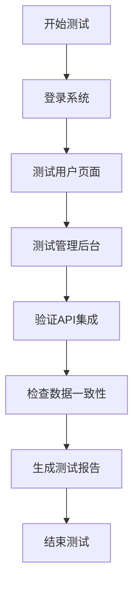

# Production QA Verification - Design

## 1. Architecture Overview

### 1.1 Testing Strategy
使用Chrome DevTools MCP工具进行自动化测试：
- 页面导航和快照验证
- 网络请求监控
- 控制台消息捕获
- API响应验证

### 1.2 Test Categories
```
测试分类：
├── 1. 认证流程 (Login/Logout)
├── 2. 用户页面 (8个页面)
│   ├── 仪表盘
│   ├── 静态IP选购
│   ├── 静态IP管理
│   ├── 动态住宅管理
│   ├── 钱包充值
│   ├── 账单明细
│   ├── 账户中心
│   └── 个人中心
├── 3. 管理后台 (7个页面)
│   ├── 管理仪表盘
│   ├── 用户管理
│   ├── 订单管理
│   ├── 价格管理
│   ├── 充值审核
│   └── 系统设置
└── 4. API集成验证
    ├── 985Proxy库存API
    ├── 985Proxy业务场景API
    └── 设置API
```

## 2. Detailed Design

### 2.1 Page Testing Module
每个页面测试包括：
1. **导航测试**: 访问页面URL
2. **加载验证**: 检查页面标题和主要元素
3. **网络请求**: 列出所有XHR/Fetch请求
4. **状态码检查**: 验证无404/500错误
5. **控制台检查**: 捕获error级别消息
6. **快照记录**: 保存页面结构用于验证

### 2.2 API Validation Module
985Proxy API验证：
1. **环境变量检查**: 
   - PROXY_985_API_KEY是否配置
   - PROXY_985_ZONE是否配置
2. **API调用测试**:
   - `/res_static/ip_list` - IP库存
   - `/res_static/business_list` - 业务场景
   - `/order_result` - 订单结果
3. **响应格式验证**: 检查返回数据结构

### 2.3 Data Consistency Module
检查数据一致性：
1. **硬编码检测**:
   - 检查余额是否动态加载
   - 检查统计数据是否从API获取
   - 检查客服链接是否从配置读取
2. **赠送余额移除确认**:
   - 账户中心不显示赠送余额
   - API不返回gift_balance字段

## 3. Testing Flow

### 3.1 Pre-Test Setup


### 3.2 Test Execution Flow


## 4. Test Data Structure

### 4.1 Test Result Format
```typescript
interface PageTestResult {
  pageName: string;
  url: string;
  status: 'pass' | 'fail' | 'warning';
  loadTime: number;
  errors: ConsoleError[];
  networkRequests: NetworkRequest[];
  apiErrors: ApiError[];
  snapshot: string;
}

interface TestReport {
  totalPages: number;
  passedPages: number;
  failedPages: number;
  warningPages: number;
  criticalIssues: Issue[];
  recommendations: string[];
  executionTime: number;
}
```

## 5. Error Handling

### 5.1 Critical Errors (测试失败)
- 页面返回404/500
- 控制台有error级别消息
- 关键API调用失败
- 数据显示为null/undefined

### 5.2 Warnings (可接受)
- 控制台warn级别消息
- API响应较慢(>2s)
- 非关键功能异常

### 5.3 Info (记录但不影响)
- 页面加载时间
- API响应时间
- 资源加载统计

## 6. Technology Stack

### 6.1 Testing Tools
- **Chrome DevTools MCP**: 主要测试工具
  - `navigate_page`: 页面导航
  - `take_snapshot`: 页面快照
  - `list_network_requests`: 网络监控
  - `list_console_messages`: 控制台监控
  - `get_network_request`: 请求详情

### 6.2 Environment
- Docker Compose (CN镜像)
- PostgreSQL数据库
- Redis缓存
- Nginx反向代理

## 7. Implementation Plan

### 7.1 Phase 1: Setup & Configuration
- 检查Docker容器状态
- 验证985Proxy API配置
- 确认数据库连接

### 7.2 Phase 2: Core Testing
- 执行所有页面测试
- 验证API集成
- 检查数据一致性

### 7.3 Phase 3: Report & Validation
- 生成测试报告
- 标记关键问题
- 提供修复建议

## 8. Success Metrics
- **页面加载成功率**: >= 95%
- **API成功率**: >= 98%
- **零关键错误**: 0个error级别控制台消息
- **数据一致性**: 100%（无硬编码数据）
- **985Proxy集成**: 所有API正常工作

