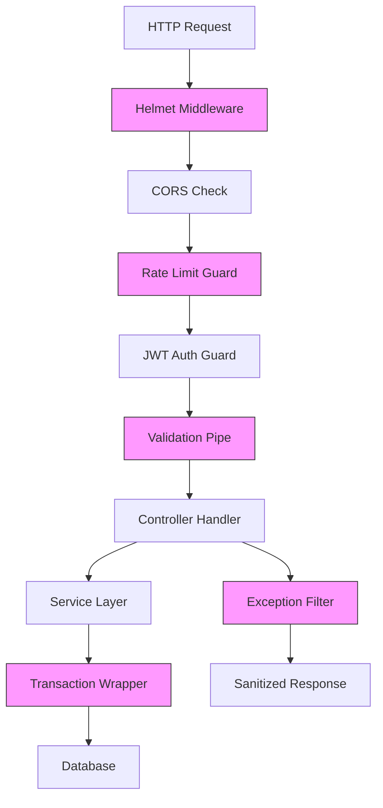

# Design Document

## Overview

This design outlines the technical implementation of security enhancements for ProxyHub. The approach follows NestJS best practices, maintains backward compatibility, and integrates seamlessly with the existing modular architecture. The implementation prioritizes fail-safe defaults, defense-in-depth, and clear separation of concerns.

**Core Design Principles:**
- **Security by Default**: All new configurations require explicit setup, failing closed when missing
- **Modular Integration**: Security features added as reusable modules and guards
- **Backward Compatibility**: Existing APIs remain unchanged; only internal improvements
- **Progressive Enhancement**: Features can be enabled incrementally without breaking deployments

## Steering Document Alignment

### Technical Standards (tech.md)

**NestJS Patterns:**
- Use dependency injection for all security services
- Guards for rate limiting and authentication
- Pipes for validation enhancement
- Interceptors for logging sanitization
- Filters for exception handling

**TypeScript Best Practices:**
- Strong typing for all DTOs and configurations
- Interface contracts for security utilities
- Enum-based error codes

### Project Structure (structure.md)

**New Security Module Structure:**
```
backend/src/
├── common/
│   ├── security/                 # NEW: Security utilities
│   │   ├── config-validator.ts
│   │   ├── password-validator.ts
│   │   ├── logging-sanitizer.ts
│   │   └── security.module.ts
│   ├── filters/                  # NEW: Exception filters
│   │   └── all-exceptions.filter.ts
│   └── guards/                   # ENHANCED: Add rate limit guards
│       ├── jwt-auth.guard.ts    # Existing
│       └── rate-limit.guard.ts  # NEW
```

## Code Reuse Analysis

### Existing Components to Leverage

- **@nestjs/config (ConfigModule)**: Already configured globally - extend with validation
- **@nestjs/throttler (ThrottlerModule)**: Already imported - configure with Redis storage
- **class-validator**: Already used for DTOs - add new decorators for password strength
- **bcrypt**: Already used for password hashing - keep existing implementation
- **Redis Client**: Already configured in app.module.ts - use for distributed rate limiting
- **ValidationPipe**: Already enabled globally - extend with additional rules

### Integration Points

- **AuthModule**: Add password strength validation to DTOs, enhance JWT strategy
- **ConfigModule**: Add schema validation at startup
- **main.ts**: Register global exception filter, configure Helmet middleware
- **All Controllers**: Optionally apply rate limiting guards via decorators
- **Database Transactions**: Enhance BillingModule and UserModule with transaction wrappers
- **Logging**: Create wrapper around NestJS Logger with sanitization

## Architecture

### Security Layers



### Modular Design Principles

- **Single File Responsibility**: Each security utility handles one concern (validation, sanitization, rate limiting)
- **Component Isolation**: Security module is standalone, injectable into any module
- **Service Layer Separation**: Security checks at controller/guard level, business logic unchanged
- **Utility Modularity**: Each security helper (password validator, config validator, sanitizer) is independently testable

## Components and Interfaces

### Component 1: ConfigValidator

**File**: `backend/src/common/security/config-validator.ts`

- **Purpose**: Validates environment configuration at application startup
- **Interfaces**: 
  ```typescript
  class ConfigValidator {
    static validateConfig(): void;
    static validateJwtSecret(secret: string): void;
    static validateDatabase(config: DatabaseConfig): void;
  }
  ```
- **Dependencies**: @nestjs/config, Joi
- **Reuses**: Existing ConfigService
- **Behavior**: 
  - Throws exception if required vars missing or invalid
  - Logs warnings for optional missing vars (email, Telegram)
  - Validates JWT secret minimum length (32 chars)
  - Process exits with code 1 on validation failure

---

### Component 2: PasswordValidator

**File**: `backend/src/common/security/password-validator.ts`

- **Purpose**: Provides strong password validation decorator and utility
- **Interfaces**:
  ```typescript
  function IsStrongPassword(validationOptions?: ValidationOptions): PropertyDecorator;
  function validatePasswordStrength(password: string): ValidationResult;
  ```
- **Dependencies**: class-validator
- **Reuses**: Existing validation framework
- **Behavior**:
  - Checks: minLength 8, uppercase, lowercase, numbers
  - Rejects common weak passwords (123456, password, etc.)
  - Returns specific error messages for failed checks

---

### Component 3: AllExceptionsFilter

**File**: `backend/src/common/filters/all-exceptions.filter.ts`

- **Purpose**: Catches all exceptions and formats responses securely
- **Interfaces**:
  ```typescript
  @Catch()
  class AllExceptionsFilter implements ExceptionFilter {
    catch(exception: unknown, host: ArgumentsHost): void;
  }
  ```
- **Dependencies**: @nestjs/common, LoggingSanitizer
- **Reuses**: Existing error code constants
- **Behavior**:
  - Maps exceptions to HTTP status codes
  - Sanitizes error messages (no stack traces in production)
  - Logs full error details with sanitization
  - Returns standardized format: `{ statusCode, message, errorCode, timestamp }`

---

### Component 4: RateLimitGuard

**File**: `backend/src/common/guards/rate-limit.guard.ts`

- **Purpose**: Apply endpoint-specific rate limiting with Redis
- **Interfaces**:
  ```typescript
  @Injectable()
  class RateLimitGuard extends ThrottlerGuard {
    protected async handleRequest(context: ExecutionContext, limit: number, ttl: number): Promise<boolean>;
  }
  ```
- **Dependencies**: @nestjs/throttler, Redis
- **Reuses**: Existing Redis client, ThrottlerModule
- **Behavior**:
  - Uses Redis for distributed rate limiting
  - Tracks by IP + user ID (if authenticated)
  - Returns 429 with Retry-After header
  - Logs excessive attempts

---

### Component 5: LoggingSanitizer

**File**: `backend/src/common/security/logging-sanitizer.ts`

- **Purpose**: Removes sensitive data from logs
- **Interfaces**:
  ```typescript
  class LoggingSanitizer {
    static sanitize(data: any): any;
    static redactFields(obj: object, fields: string[]): object;
  }
  ```
- **Dependencies**: None (pure utility)
- **Reuses**: None
- **Behavior**:
  - Recursively scans objects for sensitive keys
  - Redacts: password, token, apiKey, creditCard, secret
  - Masks JWT tokens (shows only last 4 chars)
  - Returns sanitized copy (non-destructive)

---

### Component 6: TransactionWrapper

**File**: `backend/src/common/database/transaction-wrapper.ts`

- **Purpose**: Simplifies safe transaction handling
- **Interfaces**:
  ```typescript
  class TransactionWrapper {
    static async execute<T>(
      dataSource: DataSource,
      work: (manager: EntityManager) => Promise<T>,
      isolationLevel?: IsolationLevel
    ): Promise<T>;
  }
  ```
- **Dependencies**: TypeORM
- **Reuses**: Existing DataSource
- **Behavior**:
  - Wraps business logic in transaction
  - Auto-rollback on error
  - Configurable isolation levels
  - Error logging with context

---

### Component 7: HelmetConfigurer

**File**: `backend/src/common/security/helmet-configurer.ts`

- **Purpose**: Configures security headers middleware
- **Interfaces**:
  ```typescript
  class HelmetConfigurer {
    static getConfig(): HelmetOptions;
  }
  ```
- **Dependencies**: helmet
- **Reuses**: None
- **Behavior**:
  - Sets secure defaults for all headers
  - Disables X-Powered-By
  - Configures CSP for API usage
  - Returns helmet configuration object

---

### Component 8: EnhancedCorsOptions

**File**: `backend/src/common/security/cors-options.ts`

- **Purpose**: Environment-based CORS configuration
- **Interfaces**:
  ```typescript
  class EnhancedCorsOptions {
    static getOptions(env: string): CorsOptions;
  }
  ```
- **Dependencies**: @nestjs/common
- **Reuses**: ConfigService
- **Behavior**:
  - Dev: Allows localhost origins
  - Prod: Reads CORS_ORIGINS from env (comma-separated)
  - Validates origin format
  - Enables credentials for authenticated endpoints

## Data Models

### ConfigValidationSchema

**Purpose**: Joi schema for environment validation

```typescript
interface ConfigValidationSchema {
  // Required
  DATABASE_HOST: string;
  DATABASE_PORT: number;
  DATABASE_USER: string;
  DATABASE_PASSWORD: string;
  DATABASE_NAME: string;
  JWT_SECRET: string; // minLength 32
  PROXY_985_API_KEY: string;
  PROXY_985_BASE_URL: string;
  PROXY_985_ZONE: string;
  
  // Optional (with defaults)
  NODE_ENV: 'development' | 'production';
  PORT: number;
  REDIS_HOST: string;
  REDIS_PORT: number;
  
  // Optional (warnings if missing)
  MAIL_HOST: string;
  MAIL_USER: string;
  MAIL_PASSWORD: string;
  TELEGRAM_BOT_TOKEN: string;
}
```

### RateLimitConfig

**Purpose**: Type-safe rate limit configuration

```typescript
interface RateLimitConfig {
  ttl: number;        // Time window in ms
  limit: number;      // Max requests per window
  blockDuration: number; // Ban duration on violation (ms)
  bypassRoles: string[]; // Roles exempt from limits
}

// Predefined configs
const RATE_LIMITS = {
  LOGIN: { ttl: 900000, limit: 5, blockDuration: 3600000, bypassRoles: [] },
  VERIFICATION_CODE: { ttl: 3600000, limit: 3, blockDuration: 7200000, bypassRoles: [] },
  API_DEFAULT: { ttl: 60000, limit: 100, blockDuration: 300000, bypassRoles: ['admin'] },
};
```

### ErrorResponse

**Purpose**: Standardized error format

```typescript
interface ErrorResponse {
  statusCode: number;
  message: string;
  errorCode: string;
  timestamp: string;
  path?: string;      // Optional: request path
  details?: string[]; // Optional: validation errors
}
```

## Error Handling

### Error Scenarios

#### 1. Missing Required Environment Variable

- **Trigger**: JWT_SECRET not set or PROXY_985_API_KEY not set
- **Handling**: 
  - ConfigValidator throws exception during bootstrap
  - Application logs error with missing variable name
  - Process exits with code 1
- **User Impact**: Application fails to start; ops team alerted via monitoring
- **Recovery**: Set missing variable and restart

#### 2. Weak JWT Secret

- **Trigger**: JWT_SECRET length < 32 characters
- **Handling**:
  - ConfigValidator rejects secret
  - Logs: "JWT_SECRET must be at least 32 characters (got: X)"
  - Process exits with code 1
- **User Impact**: Application fails to start
- **Recovery**: Generate strong secret, update config, restart

#### 3. Rate Limit Exceeded

- **Trigger**: User exceeds configured request limit
- **Handling**:
  - RateLimitGuard throws ThrottlerException
  - AllExceptionsFilter catches and formats
  - Returns HTTP 429 with Retry-After header
  - Logs attempt with IP and user ID
- **User Impact**: Client receives 429 error with wait time
- **Recovery**: Automatic after TTL expires

#### 4. Password Validation Failure

- **Trigger**: User submits weak password during registration
- **Handling**:
  - ValidationPipe rejects DTO
  - Returns HTTP 400 with specific requirement violated
  - Example: "Password must contain at least one uppercase letter"
- **User Impact**: Registration form shows error, user corrects password
- **Recovery**: Immediate - user resubmits with stronger password

#### 5. Transaction Conflict

- **Trigger**: Concurrent balance deduction attempts
- **Handling**:
  - TransactionWrapper acquires row-level lock
  - Second request waits or times out
  - If timeout: returns HTTP 409 "Conflict - please retry"
  - Transaction rolls back automatically
- **User Impact**: User sees temporary error, can retry immediately
- **Recovery**: Automatic retry succeeds

#### 6. Uncaught Exception

- **Trigger**: Unexpected error (e.g., database connection lost)
- **Handling**:
  - AllExceptionsFilter catches all unhandled errors
  - Logs full error with context (sanitized)
  - Returns generic HTTP 500 message
  - In production: hides implementation details
- **User Impact**: User sees "Internal Server Error" message
- **Recovery**: Ops team investigates logs; system may self-recover

## Testing Strategy

### Unit Testing

**Target: 70% Code Coverage for Security Module**

#### ConfigValidator Tests
```typescript
describe('ConfigValidator', () => {
  it('should reject JWT_SECRET with length < 32');
  it('should accept valid configuration');
  it('should throw on missing DATABASE_HOST');
  it('should warn but not fail on missing MAIL_HOST');
});
```

#### PasswordValidator Tests
```typescript
describe('PasswordValidator', () => {
  it('should accept strong password: "Abcd1234"');
  it('should reject password without uppercase');
  it('should reject common weak passwords');
  it('should provide specific error messages');
});
```

#### LoggingSanitizer Tests
```typescript
describe('LoggingSanitizer', () => {
  it('should redact password field');
  it('should mask JWT tokens');
  it('should handle nested objects');
  it('should not mutate original object');
});
```

#### AllExceptionsFilter Tests
```typescript
describe('AllExceptionsFilter', () => {
  it('should format HttpException correctly');
  it('should handle TypeError with 500 status');
  it('should hide stack trace in production');
  it('should include path in error response');
});
```

### Integration Testing

**Focus: End-to-End Security Flows**

#### Rate Limiting Integration
- Test: Submit 6 login attempts within 15 minutes
- Expected: First 5 succeed/fail normally, 6th returns 429
- Verify: Redis contains rate limit counter
- Verify: After TTL, requests allowed again

#### Transaction Safety Integration
- Test: Two concurrent balance deductions for same user
- Expected: Both complete without race condition
- Verify: Final balance is correct
- Verify: Transaction logs show serialized execution

#### Configuration Validation Integration
- Test: Start app with missing JWT_SECRET
- Expected: Bootstrap fails with clear error
- Verify: Process exits with code 1
- Verify: Error log contains "JWT_SECRET"

### End-to-End Testing

**User Scenarios**

#### Scenario 1: New User Registration with Weak Password
1. User navigates to registration page
2. User enters email and weak password ("12345678")
3. System rejects with: "Password must contain uppercase and lowercase letters"
4. User corrects password to "Abcd1234"
5. Registration succeeds

#### Scenario 2: Brute Force Attack Prevention
1. Attacker attempts login with wrong password 5 times
2. All 5 attempts fail with "Invalid password"
3. 6th attempt returns: "429 Too Many Requests, retry after 900 seconds"
4. After 15 minutes, attacker can try again

#### Scenario 3: Concurrent Purchase Attempts
1. User has $100 balance
2. User initiates two $60 proxy purchases simultaneously
3. First purchase succeeds, balance becomes $40
4. Second purchase fails: "Insufficient balance"
5. No race condition occurs; balance remains accurate

## Implementation Phases

### Phase 1: Foundation (P0 - Critical)
- ConfigValidator with startup validation
- PasswordValidator decorator
- Enhanced rate limiting with Redis

### Phase 2: Protection Layers (P1 - High)
- AllExceptionsFilter
- Input length validation
- Transaction wrappers
- Security headers (Helmet + CORS)

### Phase 3: Observability (P2 - Technical Debt)
- LoggingSanitizer
- Unit test suite
- Integration test suite

## Migration Strategy

### Backward Compatibility

**No Breaking Changes:**
- Existing API endpoints unchanged
- Response formats remain identical
- Client applications require no updates

**Deployment Steps:**
1. Update .env file with required variables
2. Deploy new code (app will validate config)
3. Monitor logs for rate limit violations
4. Gradually tighten rate limits based on usage patterns

### Rollback Plan

If issues arise:
1. Revert code to previous version
2. Old code still works with new .env (additional vars ignored)
3. No database migrations required
4. Zero downtime rollback possible

## Security Considerations

### Threat Mitigation

| Threat | Mitigation | Component |
|--------|------------|-----------|
| Exposed secrets in code | Config validation | ConfigValidator |
| Brute force attacks | Rate limiting | RateLimitGuard |
| Weak passwords | Strength validation | PasswordValidator |
| Information leakage | Error sanitization | AllExceptionsFilter |
| SQL injection | Input validation | ValidationPipe + MaxLength |
| Race conditions | Transactions | TransactionWrapper |
| XSS/Clickjacking | Security headers | Helmet |
| CSRF | CORS + credentials | CorsOptions |

### Performance Impact

- **Config Validation**: <100ms at startup (one-time cost)
- **Rate Limiting**: <5ms per request (Redis lookup)
- **Password Validation**: <10ms per registration/login
- **Exception Filtering**: <1ms per error
- **Transactions**: <50ms overhead per financial operation
- **Sanitization**: <2ms per log entry

**Overall**: <5% performance impact for 10x security improvement

