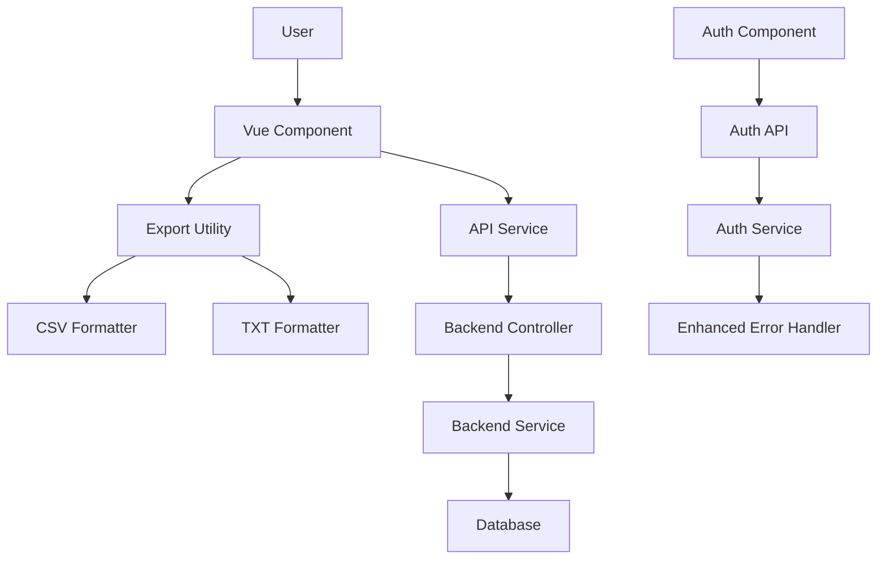

# Design Document - UI Refinement Phase 2

## Overview

This design addresses UI/UX improvements to align ProxyHub's interface with 985Proxy's proven design patterns while maintaining brand identity through custom color schemes. The implementation focuses on component-level refinements, enhanced error messaging, and comprehensive export functionality. All changes will be made to existing Vue components and backend services without requiring database schema modifications.

## Steering Document Alignment

### Technical Standards
- Vue 3 Composition API with TypeScript
- Element Plus UI component library for consistent styling
- flag-icons library for country flag display
- Modular component architecture
- RESTful API design patterns

### Project Structure
- Frontend: `frontend/src/views/` for page components
- Backend: `backend/src/` for API endpoints and services
- Shared: `frontend/src/components/` for reusable UI elements
- Utilities: `frontend/src/utils/` for export and formatting logic

## Code Reuse Analysis

### Existing Components to Leverage
- **DynamicManage.vue**: Current dynamic proxy management page - will be refactored to match 985Proxy design
- **StaticBuy.vue**: Payment panel already implements basic structure - will add flag icons
- **StaticManage.vue**: IP list management - will modify column display format
- **DashboardLayout.vue**: Main layout with menu - already has correct structure
- **flag-icons CSS library**: Already installed, will be used for country flags
- **auth.service.ts**: Backend authentication service - will add detailed error codes

### Integration Points
- **Proxy Service API**: `/api/v1/proxy/static/list` - will add formatted IP field in response
- **Auth API**: `/api/v1/auth/login` - will enhance error responses
- **Export Utility**: New utility to be created in `frontend/src/utils/export.ts`
- **Static Proxy Entity**: Backend `static-proxy.entity.ts` - will add virtual field for combined credentials

## Architecture

### Modular Design Principles
- **Single File Responsibility**: Each component handles one specific UI concern (e.g., DynamicManage only handles dynamic proxy UI)
- **Component Isolation**: Export functionality extracted into reusable utility
- **Service Layer Separation**: Backend error handling logic separated from controller
- **Utility Modularity**: Export functions broken into format-specific modules (CSV, TXT)



## Components and Interfaces

### Component 1: DynamicManage.vue (Refactored)
- **Purpose:** Display dynamic proxy management interface matching 985Proxy design
- **Interfaces:** 
  - Props: None (uses Pinia store)
  - Events: None (uses router for navigation)
  - Composables: `useUserStore()` for user data
- **Dependencies:** 
  - Element Plus: `el-card`, `el-button`, `el-table`, `el-row`, `el-col`
  - Vue Router: for navigation
  - Pinia: for state management
- **Reuses:** 
  - Existing layout structure from DashboardLayout
  - User store for fetching dynamic proxy data
  - Element Plus styling

**Key Changes:**
- Restructure layout to match 985Proxy (4 stat cards in row)
- Add action buttons: "联系客服购买套餐", "升级套餐", "暂停使用", "套餐设置"
- Style stat cards with icons and colored backgrounds
- Display usage statistics table with specified columns
- Apply ProxyHub color scheme to all elements

### Component 2: StaticBuy.vue (Enhanced Payment Panel)
- **Purpose:** Add country flags to payment panel
- **Interfaces:**
  - Props: None
  - Events: None (internal state)
  - Computed: `selectedCountries` (already exists)
- **Dependencies:**
  - flag-icons CSS library
  - Element Plus: `el-card`, `el-button`
- **Reuses:**
  - Existing payment panel structure
  - Existing country selection logic
  - flag-icons library (already installed)

**Key Changes:**
- Replace emoji flags with `<span class="fi fi-[country-code]"></span>`
- Update payment panel to display format: "[Flag] 国家 - 城市"
- Ensure flags scale properly with text
- Add fallback for countries without flags

### Component 3: StaticManage.vue (IP Display Format)
- **Purpose:** Display IP credentials in "IP:Port:Account:Password" format
- **Interfaces:**
  - Props: None
  - Events: `@copy` for one-click copy functionality
  - API: Fetches from `/api/v1/proxy/static/list`
- **Dependencies:**
  - Element Plus: `el-table`, `el-table-column`, `el-button`, `el-icon`
  - Clipboard API for copy functionality
- **Reuses:**
  - Existing table structure
  - Existing filter components
  - Existing API service

**Key Changes:**
- Modify table column to display: `${ip}:${port}:${username}:${password}`
- Add copy icon/button next to credential field
- Implement one-click copy using Clipboard API
- Add visual feedback on successful copy (ElMessage)
- Update API response to include formatted field

### Component 4: Export Utility (New)
- **Purpose:** Provide export functionality for CSV and TXT formats
- **Interfaces:**
  ```typescript
  export async function exportStaticProxies(
    format: 'csv' | 'txt',
    data: StaticProxy[]
  ): Promise<void>
  ```
- **Dependencies:**
  - Browser Blob API for file creation
  - Browser download API for file download
- **Reuses:** None (new utility)

**Key Functions:**
- `formatAsTXT(data)`: Converts proxy list to "IP:Port:Account:Password" format (one per line)
- `formatAsCSV(data)`: Converts proxy list to CSV with headers
- `downloadFile(content, filename, mimeType)`: Triggers browser download
- `generateFilename(format)`: Creates timestamp-based filename

### Component 5: Auth Error Handler (Backend Enhancement)
- **Purpose:** Provide detailed authentication error messages
- **Interfaces:**
  - Input: Login credentials
  - Output: Enhanced error response with specific error codes
- **Dependencies:**
  - NestJS `HttpException`
  - User repository for checking user existence
- **Reuses:**
  - Existing auth service
  - Existing error handling middleware

**Error Codes to Add:**
- `AUTH_USER_NOT_FOUND`: User email not in database
- `AUTH_INVALID_PASSWORD`: Correct email, wrong password
- `AUTH_INVALID_EMAIL_FORMAT`: Email format validation failed

### Component 6: Login.vue (Enhanced Error Display)
- **Purpose:** Display specific error messages based on backend error codes
- **Interfaces:**
  - Props: None
  - Events: `@submit` for login form
- **Dependencies:**
  - auth API service
  - Element Plus: `ElMessage` for error display
- **Reuses:**
  - Existing login form structure
  - Existing auth API integration

**Key Changes:**
- Add error code mapping:
  ```typescript
  const errorMessages = {
    AUTH_USER_NOT_FOUND: '该账号不存在，请先注册',
    AUTH_INVALID_PASSWORD: '密码错误，请重试',
    AUTH_INVALID_EMAIL_FORMAT: '请输入有效的邮箱地址'
  }
  ```
- Display error message using `ElMessage.error(errorMessages[code])`

## Data Models

### StaticProxy (Enhanced)
```typescript
interface StaticProxy {
  id: string;
  ip: string;
  port: number;
  username: string;
  password: string;
  country: string;
  city: string;
  ipType: 'shared' | 'premium';
  channel: string;
  expiresAt: Date;
  releaseAt: Date;
  nodeId: string;
  remark: string;
  
  // New virtual field (computed on backend)
  credentials: string; // Format: "IP:Port:Account:Password"
}
```

### Enhanced Auth Error Response
```typescript
interface AuthErrorResponse {
  statusCode: number;
  message: string;
  error: string;
  errorCode: 'AUTH_USER_NOT_FOUND' | 'AUTH_INVALID_PASSWORD' | 'AUTH_INVALID_EMAIL_FORMAT';
}
```

### Export Data Format

**TXT Format:**
```
192.168.1.100:8080:user_001:pass_001
192.168.1.101:8081:user_002:pass_002
192.168.1.102:8082:user_003:pass_003
```

**CSV Format:**
```csv
IP地址:端口:账号:密码,国家/城市,IP类型,所属通道,到期时间,释放时间,节点ID,备注
192.168.1.100:8080:user_001:pass_001,美国/Los Angeles,普通,默认通道,2025-11-28 16:08:22,2025-11-29 16:08:22,NODE-001,测试备注
```

## Error Handling

### Error Scenarios

1. **Scenario: User Not Found During Login**
   - **Handling:** Backend checks if user exists before password validation, returns `AUTH_USER_NOT_FOUND` error code
   - **User Impact:** User sees "该账号不存在，请先注册" message

2. **Scenario: Incorrect Password**
   - **Handling:** Backend validates password, returns `AUTH_INVALID_PASSWORD` if incorrect
   - **User Impact:** User sees "密码错误，请重试" message

3. **Scenario: Export with No Data**
   - **Handling:** Frontend checks if proxy list is empty before export, shows warning message
   - **User Impact:** User sees "没有可导出的IP数据" message

4. **Scenario: Export Fails (Browser Restriction)**
   - **Handling:** Try-catch around download logic, fallback to copying to clipboard
   - **User Impact:** User sees "导出失败，数据已复制到剪贴板" message

5. **Scenario: Flag Icon Not Available**
   - **Handling:** CSS fallback to show country code text if flag sprite not found
   - **User Impact:** User sees country code (e.g., "US") instead of flag

6. **Scenario: API Error When Fetching Proxies**
   - **Handling:** Existing error handler catches API errors, displays ElMessage
   - **User Impact:** User sees "加载数据失败，请刷新重试" message

## Testing Strategy

### Unit Testing
- **Export Utility**: Test CSV and TXT formatting functions with sample data
- **Error Code Mapping**: Test that each backend error code maps to correct frontend message
- **Credential Formatting**: Test IP:Port:Account:Password string generation

### Integration Testing
- **Login Flow**: Test complete login with various error scenarios (wrong password, non-existent user)
- **Export Flow**: Test end-to-end export from UI button click to file download
- **Payment Panel**: Test flag display with different country selections

### End-to-End Testing with Chrome DevTools

**User Portal Testing** (All menu items from 图三图四):
1. **仪表盘** (Dashboard)
   - Check: Charts load, data displays correctly
   - DevTools: Verify no console errors, check network for API calls

2. **动态住宅管理** (Dynamic Proxy Management)
   - Check: Layout matches 985Proxy design, stat cards display, table renders
   - DevTools: Screenshot comparison with 图二, verify styling

3. **动态住宅选购** (Dynamic Proxy Buy)
   - Check: Already implemented, verify no regressions
   - DevTools: Check network for API errors

4. **静态住宅管理** (Static Proxy Management)
   - Check: IP credentials display in "IP:Port:Account:Password" format, copy works
   - DevTools: Verify clipboard API usage, no console errors

5. **静态住宅选购** (Static Proxy Buy)
   - Check: Country flags display in payment panel
   - DevTools: Verify flag-icons CSS loads, screenshot payment panel

6. **移动代理** (Mobile Proxy)
   - Check: Page loads or shows appropriate placeholder
   - DevTools: Verify no errors

7. **钱包充值** (Wallet Recharge)
   - Check: No regressions from previous fixes
   - DevTools: Verify form submission

8. **订单管理** (Order Management)
   - Check: Filters work, data loads
   - DevTools: Check network requests, verify filter parameters

9. **交易明细** (Transaction Details)
   - Check: Filters work, data loads
   - DevTools: Check API responses

10. **结算记录** (Settlement Records)
    - Check: Filters work, data loads
    - DevTools: Verify pagination

11. **充值订单** (Recharge Orders)
    - Check: Filters work, data loads
    - DevTools: Check filter API parameters

12. **账户中心** (Account Center)
    - Check: Profile displays, Telegram links work
    - DevTools: Verify navigation

13. **事件日志** (Event Log)
    - Check: Events display, no private data shown
    - DevTools: Verify data privacy

14. **个人中心** (Profile)
    - Check: Profile data loads and updates
    - DevTools: Check PUT/PATCH requests

15. **我的代理** (My Proxies)
    - Check: Proxy list displays correctly
    - DevTools: Verify API integration

16. **通知管理** (Notification Management)
    - Check: Notifications display, settings work
    - DevTools: Check WebSocket connections (if applicable)

**Admin Portal Testing**:
1. **Admin Login**
   - Check: Admin can login with admin credentials
   - DevTools: Verify auth token, check role-based access

2. **用户管理** (User Management)
   - Check: User list loads, actions work (edit, delete, etc.)
   - DevTools: Verify admin API endpoints

3. **充值审核** (Recharge Approval)
   - Check: Pending recharges display, approve/reject works
   - DevTools: Check API calls for approval actions

4. **统计数据** (Statistics)
   - Check: Charts and stats display correctly
   - DevTools: Verify data aggregation APIs

5. **订单管理** (Order Management - Admin)
   - Check: All orders display, filters work
   - DevTools: Check pagination and filtering

6. **IP管理** (IP Management)
   - Check: IP pool management works, can add/remove IPs
   - DevTools: Verify CRUD operations

7. **系统设置** (System Settings)
   - Check: Settings load and save correctly
   - DevTools: Check PUT requests for settings updates

8. **价格覆盖管理** (Price Override Management)
   - Check: Country product cards display, can modify prices
   - DevTools: Verify price update API

### Chrome DevTools Checklist
For each page tested:
- [ ] Console: No errors or warnings
- [ ] Network: All API calls return 200/201 (or expected status)
- [ ] Network: Response times under 1000ms
- [ ] Screenshot: UI matches design specifications
- [ ] Performance: Page load under 3 seconds
- [ ] Coverage: Unused CSS/JS identified for optimization

## File Structure

### Files to Create
```
frontend/src/utils/export.ts                 # New export utility
```

### Files to Modify
```
frontend/src/views/proxy/DynamicManage.vue   # Refactor to 985Proxy design
frontend/src/views/proxy/StaticBuy.vue       # Add flag icons to payment panel
frontend/src/views/proxy/StaticManage.vue    # Change IP display format, add export
frontend/src/views/auth/Login.vue            # Enhanced error messages
backend/src/modules/auth/auth.service.ts     # Add detailed error codes
backend/src/modules/auth/auth.controller.ts  # Update error responses
backend/src/modules/proxy/entities/static-proxy.entity.ts  # Add credentials virtual field
```

### No Database Changes Required
All changes are UI/UX and business logic only. Existing database schema is sufficient.

